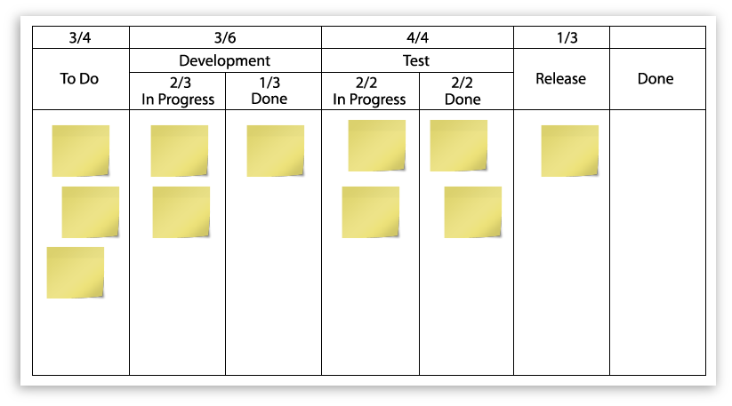
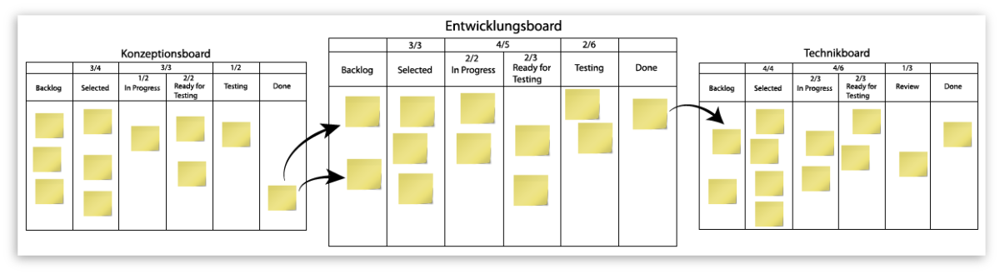
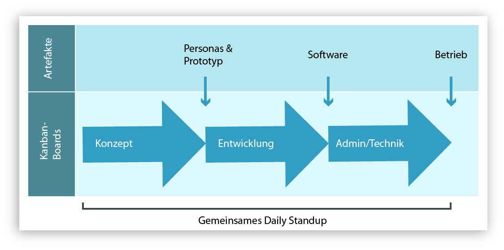

# User Experience in Kanban

???+ example "Grundlage dieses Beitrags sind folgende Publikationen"

    1. Winter, D.; Schön, E.-M.; Uhlenbrok, J. & Thomaschewski, J. (2013). **[User Experience in Kanban](https://dl.gi.de/handle/20.500.12116/173)**. In: Brau, H.; Lehmann, A.; Petrovic, K. & Schroeder, M. C. (Hrsg.), Tagungsband UP13. Stuttgart: German UPA e.V. (S. 220–224).

    2. Uhlenbrok, J.; Schön, E.-M.; Winter, D. & Thomaschewski, J. (2015). **[User Experience in Kanban – Case Study: Erfahrungen aus dem Relaunch eines Internetportals](https://www.degruyter.com/document/doi/10.1515/9783110443882-010/html)**. In: Endmann, A.; Fischer, H. & Krökel, M. (Hrsg.), Mensch und Computer 2015 – Usability Professionals. Berlin: De Gruyter Oldenbourg. (S. 84–94).

    3. Schön, E.-M.; Winter, D.; Uhlenbrok, J.; Escalona, M. & Thomaschewski, J. (2016). **[Enterprise Experience into the Integration of Human-Centered Design and Kanban](https://www.scitepress.org/PublishedPapers/2016/59426/)**. In: Proceedings of the 11th International Joint Conference on Software Technologies (ICSOFT 2016) – Volume 1. (S. 133–140).

In diesem Beitrag wird davon ausgegangen, dass Sie die Grundzüge von Kanban kennen und eine Integration von Kanban und dem Human-Centred Design anstreben. Zu Kanban gibt es eine Reihe guter Informationen, z.B. bei [Wikipedia](https://de.wikipedia.org/wiki/Kanban).

Wenn Unternehmen interaktive Produkte entwickeln, müssen diese eine positive User Experience aufweisen, um wettbewerbsfähig zu sein. Die Integration von Human-Centred Design (HCD) in die agile Softwareentwicklung ist daher notwendig. Es gibt viele Erfahrungen und Best Practices, die sich mit der Integration von HCD in Scrum beschäftigen. Doch auch Kanban erfreut sich großer Beliebtheit und wird immer häufiger in IT-Projekten eingesetzt. Trotz dieses Trends gibt es kaum Untersuchungen zur Integration von Kanban und HCD.

In diesem Beitrag berichten wir über wissenschaftlich erhobene Ergebnisse der Integration von Kanban und HCD anhand eines größeren Relaunch-Projektes.

## Kanban und HCD

Kanban ist eine agile Projektmanagementmethode aus der Softwareentwicklung, die ihre Ursprünge beim japanischen Automobilhersteller Toyota hat. Der Automobilhersteller wollte einen gleichmäßigen Fluss („Flow“) in der Fertigung herstellen und so Lagerbestände reduzieren. David Anderson passte die Methode an und übertrug sie auf den IT-Bereich. Auch hier werden geringe Durchlaufzeiten während des Entwicklungsprozesses angestrebt. Im Fokus der Entwicklung steht immer die aktuelle Aufgabe. Die Wertschöpfungskette wird mit Hilfe eines Kanban-Boards visualisiert. Für gute Ergebnisse muss der Gestaltungsprozess den Prinzipien des Human-Centred Design (HCD) folgen. Agile Projekte stehen aber vor der Herausforderung, nicht nur einzelne Aufgaben, sondern auch das Gesamtprojekt zielgerichtet und nutzerzentriert zu realisieren.

## Kanban vs. Scrum

Was genau unterscheidet Kanban und Scrum nun voneinander?

Im Vergleich zu Scrum ist Kanban wesentlich freier und hat weniger Vorgaben. Rollen, wie etwa der Product Owner in Scrum, sind hier nicht definiert. Anstelle der Scrum Sprints findet bei Kanban eine kontinuierliche Entwicklung statt. Die Teammitglieder betrachten dabei nur ihre eigenen Aufgaben in ihrem jeweiligen Fachgebiet. Durch die kleinteilige Arbeitsverteilung der Produktbestandteile ist jedoch die Erschaffung einer positiven User Experience ohne eine Konzeption des Gesamtprodukts schwierig.

Bei Scrum sind interdisziplinäre Teams notwendig, da dort alle nötigen Fertigkeiten zur Produktentwicklung gebündelt vorhanden sein müssen. Diese bestehen neben Programmierern auch aus Konzeptern, Business-Analysten und Designern. Kanban aber funktioniert auch in bestehenden nicht-interdisziplinären Teams. Daher ist die Einführung von Kanban im Hinblick auf nötige Anpassungen in der Organisation weniger aufwändig als bei Scrum. Kanban macht den Workflow sichtbar und das bestehende Prozessmodell kann schrittweise angepasst und verbessert werden. Kanban ermöglicht somit einen sanften Umstieg in die agile Entwicklung und kann auch ohne sofortige Änderung der gesamten etablierten Entwicklungsprozesse eingeführt werden.

## Prozessablauf

Das Kanban-Board dient der Visualisierung der Arbeitsaufgaben und hat mehrere Spalten, die von den einzelnen Aufgaben durchwandert werden. Dieser „Flow“ kann zusätzlich durch eine Begrenzung der Anzahl an gleichzeitig in Arbeit befindlichen Aufgaben pro Spalte gesteuert werden. So werden Engpässe schnell sichtbar und es können durch den „Flaschenhals-Effekt“ auch nur so viele Aufgaben weitergereicht werden, wie es das Limit der nächsten Spalte zulässt.

<figure markdown>
  
  <figcaption>Abbildung 1: Beispiel eines Kanban-Boards.</figcaption>
</figure>

Die Fokussierung auf kleinteilige Aufgaben im Kanban-Prozess hat allerdings den großen Nachteil, dass der Blick auf das „große Ganze“ nicht da ist. Eine Gesamtbetrachtung des Produkts mit dem Zusammenspiel der einzelnen Bestandteile ist jedoch wichtig zum Erreichen einer guten User Experience und auch z.B. zum Erstellen einer sinnvollen Informationsarchitektur. Die große Herausforderung für Unternehmen ist deshalb die Integration des Human-Centred Design (HCD) in den Entwicklungsprozess mit Kanban.

## Human-Centred Agile Development (HCAD)

Agile Methoden werden inzwischen gerne verwendet. Dadurch ist auch der Forschungsbereich Human-Centred Agile Development (HCAD) sehr beliebt und es gibt viele Publikationen in dem Bereich. Einerseits wird dort von den Herausforderungen der Integration von Human-Centred Design (HCD) und agiler Softwareentwicklung berichtet. Andererseits beschreiben die Autoren aber auch Best Practices. Schön et al. 2016 fasst die wichtigsten Aspekte zusammen, über die in der Literatur berichtet wird:

1. Durchführung einer ersten Iteration für HCD
2. Unterstützung der kontinuierlichen Einbeziehung von Stakeholdern und Benutzern
3. Integration von Prototyping- und User Experience-Testaktivitäten
4. Verwendung von einfachen Artefakten, um ein gemeinsames Verständnis zu erreichen

Soll der Entwicklungsprozess mit Kanban diese Kriterien genügen, muss er um einige Methoden ergänzt werden.

## Anpassung des Workflows

Zur Integration des Human-Centred Design (HCD) in Kanban muss die Wertschöpfungskette angepasst werden. Ziel ist ein strukturierter Workflow, in dem die Anforderungen (Requirements) durch den gesamten Entwicklungsprozess sichtbar bleiben. Zu diesem Zweck sind unter anderem zusätzliche Kanban-Boards, wie etwa ein Konzeptionsboard, sinnvoll, und auch HCD-Evaluationen sollten ihren festen Platz haben. Auch Rituale und die Einführung von UX-Artefakten (Persona Stories, Prototypen) sind vorteilhaft. Nachfolgend werden die einzelnen Maßnahmen näher vorgestellt.

### Konzeptionsboard

Bei der Verwendung zusätzlicher Kanban-Boards bietet sich speziell die Nutzung eines Konzeptionsboards an. Der Workflow auf dem Kanban-Board wird oft aus einer technischen Perspektive mit Programmieraufgaben und den dazugehörigen Abnahme- und Auslieferungstätigkeiten visualisiert. Die konzeptionellen Aufgaben, wie z.B. User Research oder die Spezifizierung von Benutzeranforderungen, hingegen werden vernachlässigt. Diese sind für eine erfolgreiche Umsetzung des Human-Centred Design jedoch essenziell.

Im Artikel von Winter et al. 2013 wurde erstmals eine Erweiterung nach „vorne“ um ein Konzeptionsboard vorgeschlagen. So können konzeptionelle Aufgaben auf die gleiche Weise wie Programmieraufgaben auf dem Entwicklungsboard organisiert werden. Müssen mehrere Teams (z.B. Konzeptionsteam und Programmierteam) abgebildet werden, können dafür auch mehrere Boards parallel genutzt werden.

Liegen Ergebnisse auf dem Konzeptionsboard vor, wandern diese zum nächsten Board, dem Entwicklungsboard. Die Auslieferung erfolgt dann schlussendlich durch ein Administrations- oder Technikteam. Diese Arbeitsweise ermöglicht auch die Aufdeckung von Engstellen zwischen den Teams bzw. den einzelnen Boards.

<figure markdown>
  
  <figcaption>Abbildung 2: Kombination mehrerer Kanban-Boards – Eine Aufgabe vom Konzeptionsboard kann z.B. auf dem Entwicklungsboard in mehrere Aufgaben aufgeteilt werden.</figcaption>
</figure>

Auch wenn bei mehreren Kanban-Boards mit getrennten Teams gearbeitet werden kann, müssen diese Aufgaben und Parameter wie etwa Realisierbarkeit oder Aufwand miteinander abstimmen. Teamübergreifende Meetings können die Grundlage für die Übergabe vom Konzeptionsboard zum Entwicklungsboard schaffen. Zusätzlich sind gemeinsame Daily Standup-Meetings sinnvoll, da sie den Austausch der beteiligten Teams fördern. So bekommt einerseits das Entwicklungsteam Informationen über zukünftige Aufgaben und andererseits erfährt das Konzeptionsteam von aktuellen Problemen bei der Realisierung. Des Weiteren müssen alle Teams die langfristige Entwicklungsplanung kennen. Daher ist eine teamübergreifende Kommunikation für die Gesamtübersicht aller Projektbeteiligten sehr wichtig. Zur Zielkontrolle muss am Ende, nach Durchlaufen des gesamten Prozesses, ein Abgleich zwischen dem Ergebnis und den Planungen des Konzeptionsboards vorgenommen werden.

<figure markdown>
  
  <figcaption>Abbildung 3: Teamübergreifender Kanban-Prozess.</figcaption>
</figure>

### Team-Arbeit

Team-Arbeit versteht sich als interdisziplinäre Zusammenarbeit, denn geschlossene Gruppen von Experten können zur Bildung von sogenannten „funktionalen Silos“ führen. Im agilen Bereich hat die interdisziplinäre Zusammenarbeit einen hohen Stellenwert. Diese hat den Vorteil, dass Ideen schon in frühen Phasen der Softwareentwicklung von unterschiedlichen Seiten beleuchtet werden können. So kann z.B. ein UX-Entwickler bei der Konzeption eines neuen Features einen Frontend-Entwickler zu Rate ziehen. Dieser kann mit seinem Fachwissen Umsetzbarkeit und Aufwand bewerten und Optimierungsvorschläge beisteuern. Werden Ideen gemeinschaftlich weiterentwickelt, führt dies meist zu besseren Lösungen, die sich wiederum positiv auf die UX des zu entwickelnden Produkts auswirken. Eine mögliche Maßnahme zur Förderung des Austauschs zwischen den Teams ist zum Beispiel ein teamübergreifendes Daily Standup.

### Release Evaluation

Mit der Zeit werden immer mehr Aufgaben auf dem Board abgearbeitet und wandern in die letzte Spalte des Boards, wo sie sich gemäß den Kanban-Regeln ohne Begrenzung (= WIP-Limit) sammeln. Für eine regelmäßige Evaluation bezüglich der nutzerbezogenen Eigenschaften eines Produkts wird auch für diese „Done“-Spalte ein WIP-Limit eingeführt, dessen Höhe abhängig von der Teamgröße und den Releasezyklen ist. Sobald dieses Limit erreicht ist, wird eine Release Evaluation vorgenommen. Aus den Evaluationen resultieren Optimierungen, die als neue Aufgaben in den Kanban-Prozess eingeplant werden können. Der so entstehende iterative Kontrollmechanismus ermöglicht die langfristige Verfolgung einer User Experience-Strategie.

### UX-Artefakte

Die Verwendung von UX-Artefakten bildet die Grundlage für ein gemeinsames Problemverständnis und hilft beim Transport von Ideen für anstehende Entscheidungen.

> „Damit die am Projekt beteiligten Menschen eine einheitliche Sprache verwenden und eine gemeinsame Vision vom Produkt teilen, ist es wichtig, mit den gleichen Artefakten zu arbeiten.“ (Uhlenbrok et al. 2015)

In der agilen Produktentwicklung haben sich folgende Artefakte bewährt (Winter et al. 2013):

- **Personas**: Das Erstellen von Profilen fiktiver Personen mit konkreten Eigenschaften und Bedürfnissen stellt einen effektiven Weg dar, potenzielle Nutzer besser zu verstehen. Auch Funktionen und Funktionalitäten können mithilfe von Personas besser priorisiert und das Design von digitalen Produkten und Dienstleistungen entsprechend gelenkt werden.

- **Persona Stories**: Zur Darstellung von Anforderungen, aber auch zur Abgrenzung des Produktumfangs, werden oftmals User Stories verwendet. Eine User Story besteht aus der textuellen Beschreibung der Anforderung, der Team-Diskussion über selbige und den Akzeptanzkriterien, aus denen hervorgeht, wann die User Story abgenommen werden kann. Persona Stories ([früher auch Persona-driven User Stories genannt](https://dl.gi.de/server/api/core/bitstreams/d06fcc62-f697-45f7-90a0-c61228cf4d58/content)) können verwendet werden, wenn Personas entwickelt wurden. Es handelt sich also um spezielle User Stories, die in direkter Verbindung zu einer bestimmten Persona stehen und damit den Nutzer greifbarer machen. Persona Stories werden in Kanban nicht nur zur Konzeption genutzt, sondern den gesamten Entwicklungsprozess hindurch verwendet.

- **Prototypen**: Ein großer Vorteil von Prototypen ist die Möglichkeit, komplexe Zusammenhänge einzelner Anforderungen zeigen zu können und Arbeitsabläufe von Nutzern zu visualisieren. Auf diese Weise erhalten die Projektbeteiligten eine gute Vorstellung des zu entwickelnden Produkts. So kann schon sehr früh überprüft werden, ob „das konzeptuelle Modell mit den Annahmen über das mentale Modell übereinstimmt“ und somit eine intuitive User Experience vorhanden ist. Zusätzlich kann schon vor der eigentlichen Entwicklung Nutzerfeedback eingeholt werden und es können erste Usability-Tests durchgeführt werden. Die daraus gewonnenen Erkenntnisse fließen anschließend in die Produktentwicklung ein.

Eine gute Übersicht über einen nachvollziehbaren Prozess von Personas zum Prototypen finden Sie unter [„Templatebasierter Prozess zu Human Centred-Design“](templatebasierter-prozess-zu-human-centred-design/index.md).

## Case Study

In den Jahren 2013/2014 wurde die Integration von UX in Kanban im Rahmen des Relaunches eines Internetportals in der Praxis eingesetzt. Basierend auf dem obigen Ansatz bezüglich der Integration des HCD in Kanban, wurden für die Durchführung der Case Study von Uhlenbrok et al. 2015 vier Forschungsfragen formuliert:

1. Welche Vorteile bringt der Einsatz eines Konzeptionsboards in Kanban?
2. Wie hat sich die interdisziplinäre Zusammenarbeit gestaltet?
3. Wie wurde die Release Evaluation durchgeführt?
4. Wie sind die UX-Artefakte integriert worden?

Während des Projekts wurde in einer IT-Organisation das vorhandene Entwicklungsboard um ein vorgelagertes Konzeptionsboard ergänzt. Das zwölfköpfige interdisziplinäre Team hatte somit die nötigen Strukturen für einen teamübergreifenden Austausch, der wiederum bei der Vermeidung funktionaler Silos hilft. Für die letzte Spalte des Konzeptionsboards wurde ein WIP-Limit festgelegt. War dieses Limit erreicht, wurde eine Release Evaluation durchgeführt und dabei erkannte UX-Probleme von Experten überprüft und mit den Entwicklern zusammen schnellstmöglich behoben. Persona Stories fanden keine Verwendung, da mit Personas im Unternehmen zum Projektzeitpunkt noch nicht gearbeitet wurde. Stattdessen wurde mit einfachen User Stories gearbeitet und für komplexere Bereiche Prototypen konstruiert. Letztere fanden sich auf dem Konzeptionsboard in der Spalte „Testing“ wieder.

## Ergebnisse

Die Integration von HCD in Kanban führte zu einer verbesserten interdisziplinären Zusammenarbeit und einer stärkeren Fokussierung auf die Nutzerbedürfnisse. Durch die Einführung des Konzeptionsboards konnten konzeptionelle Aufgaben klarer strukturiert und effizienter in den Entwicklungsprozess integriert werden. Die regelmäßigen Release Evaluations ermöglichten eine kontinuierliche Verbesserung der User Experience des Produkts.

## Fazit

Die Kombination von Kanban und Human-Centred Design bietet ein effektives Framework zur Entwicklung nutzerzentrierter Produkte. Durch die Anpassung des Workflows, die Einführung von Konzeptionsboards und die Nutzung von UX-Artefakten kann die User Experience nachhaltig verbessert werden.

???+ tip "Experten Jörg Thomaschewski, Andreas Hinderks, Dominique Winter"
    **Jörg Thomaschewski** (<small>Prof. Dr.</small>){align=right width="20%"}  arbeitet an der Hochschule Emden/Leer und ist Gründer der Forschungsgruppe "Research Group for Agile Software Development and User Experience". Als Mitentwickler der UEQ-Familie (UEQ-S, UEQ+) hat er praxisorientierte Werkzeuge geschaffen, die weltweit zur Analyse und Optimierung der UX eingesetzt werden. Neben seiner akademischen Tätigkeit berät und schult er Unternehmen in den Bereichen UX-Management und agile Methoden. Sein Ziel ist es, Forschung und Praxis zu verbinden, um Unternehmen bei der Entwicklung benutzerzentrierter digitaler Produkte zu unterstützen.

    ---

    **Marie Poenisch** {align=right width="20%"}  ist Medieninformatikerin mit den Schwerpunkten User Experience, Webentwicklung und Spiele. Sie betreibt den YouTube-Kanal "nordsprech" und schreibt für die Fachzeitschrift "Spielbox" über Brettspiele. Sie arbeitet bei CEWE als Enterprise Developer und User Experience Designerin.

 
