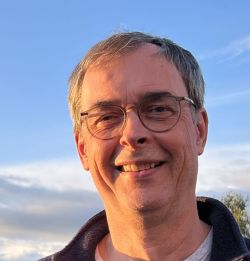

# Über mich
{align=left width="25%"}

Professor für Medieninformatik an der Hochschule Emden/Leer (Fachbereich Technik) mit den Lehr- und Forschungsschwerpunkten **"Agile Software Development and User Experience"** u.a. in den Bereichen UX-Fragebögen, UX-Management, Requirements Engineering, Scrum, Kanban, Internet-Programmierung und E-Learning.

## Gremien-Tätigkeit
* 09/2001  – 12/2002  Studiendekan Fachbereich Technik, Abt. E+I
* 09/2001  – 05/2019  Mitglied der VFH-Fachausschüsse FAMI und GemKA
* 12/2002  – 03/2012  Mitglied in der Studienkommission Fachbereich Technik, Abt. E+I
* 01/2003  – 02/2012  Studiengangsprecher Online Bachelorstudiengang Medieninformatik
* 09/2005  – 08/2019  Studiengangsprecher Online Masterstudiengang Medieninformatik
* 03/2005  – 02/2020  Vorsitzender der Zulassungskommission für den Online Masterstudiengang Medieninformatik
* 09/2004  – 02/2015  Mitglied in der Prüfungskommission Abt. E+I, zuständig für die Studiengänge Medientechnik (BA) und Medieninformatik (BA & MA)
* 03/2015  – 04/2019  Vorsitzender der Prüfungskommission für die Onlinestudiengänge Medieninformatik (BA & MA) Wirtschaftsinformatik (BA), Regenerative Energien (BA)
* 03/2010  – 02/2012  Mitglied des Senats der Hochschule Emden/Leer
* 03/2016  – 02/2018  Mitglied des Senats der Hochschule Emden/Leer

## Wirtschaftsförderung
* 04/2001 – 10/2005  Stellvertretender Institutsvorsitzender des Instituts für Medien und Technik am Fachbereich Technik 
* 10/2003  – 12/2013  Projektleiter im Institut „Institut für Innovations-Transfer“ (N-Transfer GmbH), Standort Emden. 100% Tochter des Landes Niedersachsen
* 03/2008  – 12/2013  Institutsleiter des „Institut für Innovations –Transfer“ (N –Transfer GmbH), Standort Emden. 100% Tochter des Landes Niedersachsen

* 2003  Erhalt des mit 10.000 € dotierten Hochschulpreises für die Ausgründung der Firma "Brawur".
* 2008  Nominiert zum Professor des Jahres (Platzierung unten der Top 10) von UNICUM BERUF in der Kategorie Ingenieure und Informatiker.
* 2010  – 2013  Initiator und Mitarbeiter im TP3 „Gründungsachse“ der Fachkräfteinitiative „Ems-Achse, beste Köpfe – beste Chancen“ (Gefördert von der N-Bank)

* Langjährige Erfahrung in der Durchführung von Schulungen & Coaching zu Agile UX, also  Usability, User Experience, Human Centred Design, agile Software Development, Kanban, Scrum, agile Requirements Engineering 
* Langjährige Erfahrung in der Beratung und Begleitung von Startups und Spinoffs
* Langjährige Erfahrung in Projektbegleitung, unabhängiger IT- und Projektbewertung und der Durchführung technischer Due Dilligences

## Internationale Beziehungen
Mit allen hier genannten Universitäten gab oder gibt es einen regelmäßigen Austausch internationaler Studierender sowie regelmäßige Kontakte zum Beispiel durch Erasmus+ Teaching Mobility. Auch bin ich oftmals in spanische Forschungsprojekte einbezogen. Hier werden als "Highlights" nur die Teilnahme an Promotionsverfahren genannt.

### Universität Vigo/Spanien
Seit 2001 	 Universität Vigo/Spanien (Erasmus–Austausch und Forschungsaktivitäten, insbesondere mit Prof. Dr. Manuel (Manolo) Pérez Cota). 

* 11/2002 Dr. Garcia Perez-Schofield (Mitglied der Prüfungskommission)
* 11/2004 Dr. Ana Isabel Díez Sánchez (Mitglied der Prüfungskommission)
* 12/2009 Dr. Daniel Edgardo Riesco Yrusta (Mitglied der Prüfungskommission)

### Universität Barcelona
* 2002 - 2012	Universität Barcelona (intensiver Erasmus-Austausch)

### Universität Oviedo
Seit 2003 	Universität Oviedo (Erasmus-Austausch und Forschungsaktivitäten, insbesondere mit Prof. Dr. Juan Manuel Cueva)

* 03/2007 Dr. Daniel Fernandez Lanvin (Mitglied der Prüfungskommission)
* 04/2010 Dr. César Fernández Acebal (Internationaler Gutachter der Promotion)
* 05/2013 Dr. Miguel García Rodriguez (Internationaler Gutachter der Promotion)

### Universität Sevilla
Seit 2003 	Universität Sevilla (Erasmus–Austausch und Forschungsaktivitäten, insbesondere mit Prof. Dr. María José Escalona). 

* 02/2017 Dr. Carlos Torrecilla-Salinas (Mitglied der Prüfungskommission)
* 03/2015  – 12/2017 Dr. Eva-Maria Schön (2. Betreuer der Promotion)
* 09/2017  – 07/2021 Dr. Andreas Hinderks (2. Betreuer der Promotion)
* 05/2023 Dr. Leticia Morales (Internationaler Gutachter der Promotion)
* 11/2023 Dr. Nicolás Sánchez (Mitglied der Prüfungskommission)

## Gender
* 2008  Co-Organisator eines Symposiums im Rahmen der Gender-Tage „Frauen für die Technik gewinnen und halten“ 
* 2008 & 2009  Teilnahme an den Gendertagen und Organisation externer Vorträge sowie Teilnahme an der Tandemlehre
* 2018  Gründungsmitglied GENDERnet Hochschule Emden/Leer. Seit 06/2018 Beitritt des [GENDERnet in die LAGEN](https://www.nds-lagen.de) 
* Wissenschaftliche Publikationen mit Bezug zum Thema Gender

## Sonstige Aktivitäten 
* 2001  Vorsitzender einer Berufungskommission
* 2001 & 2008  Akkreditierung Medieninformatik (Bachelor), Verantwortlich für den VFH-Standort Emden
* 2004 & 2012  Akkreditierung Medieninformatik (Master), Verantwortlich für den VFH-Standort Emden

* 2013 - 2024 Mitglied der [Gesellschaft für Informatik](https://gi.de/) 
* Mitglied Berufsverband [German UPA](https://germanupa.de/) 
* Modulautor folgender Online-Module (je 5 ECTS) für die [Virtuelle Fachhochschule (VFH)](https://www.vfh.de/)   Mensch Computer Kommunikation, User Experience, Internetserver-Programmierung und Internettechnologien Client/Server