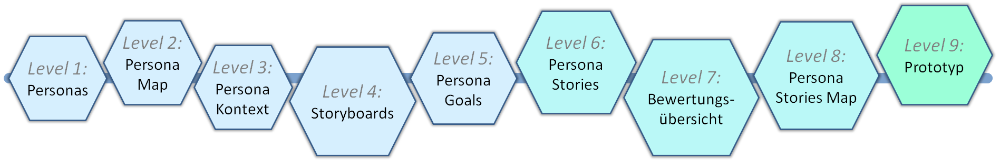

# Templatebasierter Prozess zu Human-Centred Design

???+ example "Grundlage dieses Beitrags sind folgende Publikationen"

    1. Schmitz, A. (2018). **[Erstellung eines templatebasierten Prozesses zur Durchführung des Human Centered Designs](https://www.researchgate.net/publication/325698522_Erstellung_eines_templatebasierten_Prozesses_zur_Durchfuhrung_des_Human_Centered_Designs)**. Bachelorarbeit. Hochschule Emden/Leer.

    2. Holt, E.-M.; Winter, D. & Thomaschewski, J. (2012). **[Von der Idee zum Prototypen. Werkzeuge für die agile Welt](https://dl.gi.de/bitstream/handle/20.500.12116/5935/Holt_Winter_Thomaschewski_2012.pdf)**. Usability Professionals 2012. Konstanz, 09.09.-12.09.2012. Stuttgart: German UPA. S. 22–27.

    3. Winter, D.; Holt, E.-M. & Thomaschewski, J. (2012). **[Persona driven agile development. Build up a vision with personas, sketches and persona driven user stories](https://www.researchgate.net/publication/236334825_Persona_driven_agile_development_Build_up_a_vision_with_personas_sketches_and_persona_driven_user_stories)**. In: Proceedings of the 7th conference Information Systems and Technologies (CISTI). Madrid.

    4. Hellmers, J.; Thomaschewski, J.; Holt, E.-M. & Wriedt, T. (2012). **[Usability evaluation methods for a scientific internet information portal](https://www.jucs.org/jucs_18_10/usability_evaluation_methods_for/jucs_18_10_1308_1322_hellmers.pdf)**. In: Journal of Universal Computer Science (JUCS) 18 (10), S. 1308–1322.

    5. Holt, E.-M.; Winter, D. & Thomaschewski, J. (2011). **[Personas als Werkzeug in modernen Softwareprojekten](https://dl.gi.de/bitstream/handle/20.500.12116/5888/Holt_Winter_Thomaschewski_2011.pdf)**. In: Usability Professionals 2011. Chemnitz, 10.-14.09.2011. Stuttgart: German UPA. S. 40–44.

Der Prozess des Human-Centred Design (HCD) gemäß DIN EN ISO 9241-210 (2020) ist allgemein gehalten und muss für die konkrete Umsetzung angepasst werden. Besonders bei der Entwicklung kleiner Internetanwendungen oder Apps mit schnellen Entwicklungszyklen ist ein strukturierter Prozess vorteilhaft. Hier wird ein in der Praxis erprobter, schlanker Prozess vorgestellt.

Die Begriffe Usability (Gebrauchstauglichkeit) und User Experience (Nutzererlebnis) sind zentrale Elemente des HCD und werden in der DIN EN ISO 9241 beschrieben. Usability bezieht sich auf die pragmatischen Qualitäten während der Nutzung, während User Experience auch die Phasen vor und nach der Nutzung sowie alle Vorstellungen und Wahrnehmungen umfasst.

Um eine gute Usability und User Experience zu erreichen, ist ein strukturierter, menschenzentrierter Gestaltungsprozess essenziell. Human-Centred Design fokussiert sich auf die Nutzer und deren Anforderungen, wobei auch Kenntnisse und Techniken der Arbeitswissenschaft und Ergonomie einfließen.

Anika Schmitz entwickelte im Rahmen ihrer Bachelorarbeit 2018 einen einfachen und agilen Prozess zur Durchführung des Human-Centred Design am Beispiel der App „Cam Scanner“. Dieser Prozess ist für kleine bis mittlere App- und Internetanwendungen geeignet. Die einzelnen Schritte werden in Form von Templates mit Erklärungen und Beispielen dargestellt, sodass sie vom Entwicklerteam intuitiv eingesetzt werden können. Dieser Prozess ist eine Weiterentwicklung der bereits 2011 veröffentlichten Vorgehensweisen von Holt et al. (2011) und wurde in verschiedenen Unternehmen zwischen 2011 und 2018 angewandt und kontinuierlich verfeinert.

Schmitz wählte als Beispiel eine App, die mobiles Scannen von Dokumenten ermöglicht und zusätzliche Funktionen für angemeldete und Premium-Nutzer bietet. An diesem Beispiel wurde der agile, templatebasierte HCD-Prozess durchgeführt, der als verständliche Vorlage für eigene Anwendungen dient.

Der Prozess von Schmitz (2018) basiert auf der bekannten HCD-Grafik aus der DIN EN ISO 9241-2010 mit ihren vier Prozessschritten. Schmitz passt die inhaltliche Aufteilung der Prozessschritte an und klammert den vierten Schritt der Evaluation aus. Sie konzentriert sich auf die ersten drei Schritte:

1. Verstehen und Beschreiben des Nutzungskontexts

2. Spezifizieren der Nutzungsanforderungen

3. Erarbeiten von Gestaltungslösungen zur Erfüllung der Nutzungsanforderungen (Prototyp)

Diese drei Schritte übersetzt Schmitz in neun aufeinander aufbauende Templates, die hier als Level 1-9 bezeichnet werden.

## Allgemeine Hinweise zu den erstellten Templates

Viele Kriterien für das Erstellen guter Templates sind mit den von Schmitz entwickelten Vorlagen bereits erfüllt. Dazu gehören der Lesefluss, eine einheitliche und kontrastreiche Gestaltung sowie ein logischer Aufbau.

Zusätzlich ist es wichtig, auf Übersichtlichkeit, harmonische Farbkombinationen und Druckbarkeit zu achten. Jedes Template sollte folgende Informationen enthalten:

- Versionsdatum
- Namen der Ersteller
- Namen der Tester

## Vor dem Start: Kernfragen klären

Bevor die Entwicklung beginnt, sollten folgende Punkte feststehen:

- Zielgruppe (Wen?)
- Funktion (Was?)
- Umgebung/Kontext (Wofür?)

Zunächst muss die Zielgruppe bestimmt werden. Anschließend wird das Ergebnis anhand konkreter Beschreibungen in Level 1 als Persona dargestellt.

Die Level 1-9 führen mithilfe der Templates anschaulich und praxisbezogen durch den gesamten Prozess bis hin zum Prototypen. Dadurch kann der Prozess von Schmitz als Anleitung für kleinere Anwendungen verwendet werden.

## Wie lange dauert der Prozess?

Das hängt von folgenden Faktoren ab:

- Wie komplex ist die Anwendung?
- Welche Daten liegen vor Beginn bereits vor und wie strukturiert sind diese?

Ein eingespieltes Team benötigt für alle Level möglicherweise nur wenige Tage von der Idee bis zum Prototypen. Der Aufwand für den templatebasierten Prozess ist auf jeden Fall geringer als eine spätere Neu- oder Umprogrammierung.

## Zur Bedeutung von Personas

Die am Anfang in Level 1 erstellten Personas sind für den gesamten nachfolgenden Prozess von zentraler Bedeutung. Alle Templates arbeiten mit ihren Daten, und der Erfolg des Projekts hängt von ihnen ab. Daher ist es wichtig, die Personas mit der nötigen Ruhe und Sorgfalt zu erstellen.

???+ tip "Experten Jörg Thomaschewski, Andreas Hinderks, Dominique Winter"
    **Jörg Thomaschewski** (<small>Prof. Dr.</small>){align=right width="20%"}  arbeitet an der Hochschule Emden/Leer und ist Gründer der Forschungsgruppe "Research Group for Agile Software Development and User Experience". Als Mitentwickler der UEQ-Familie (UEQ-S, UEQ+) hat er praxisorientierte Werkzeuge geschaffen, die weltweit zur Analyse und Optimierung der UX eingesetzt werden. Neben seiner akademischen Tätigkeit berät und schult er Unternehmen in den Bereichen UX-Management und agile Methoden. Sein Ziel ist es, Forschung und Praxis zu verbinden, um Unternehmen bei der Entwicklung benutzerzentrierter digitaler Produkte zu unterstützen.

    ---

    **Marie Poenisch** {align=right width="20%"}  ist Medieninformatikerin mit den Schwerpunkten User Experience, Webentwicklung und Spiele. Sie betreibt den YouTube-Kanal "nordsprech" und schreibt für die Fachzeitschrift "Spielbox" über Brettspiele. Sie arbeitet bei CEWE als Enterprise Developer und User Experience Designerin.

    ---

    **Anika Schmitz**  
    Anika Schmitz ist Medieninformatikerin und hat in ihrer Bachelorarbeit den ursprünglich von Jörg Thomaschewski entwickelten und erprobten  templatebasierten Prozess zur Durchführung des Human-Centred Designs weiter ausgearbeitet.

??? info "Bildrechte"
    <small>

    - Pexels [Online]. – 21. April 2017. – 22. März 2018. – [https://www.pexels.com/photo/adult-brainstorming-business-career-440588/](https://www.pexels.com/photo/adult-brainstorming-business-career-440588/).

    - Pexels – Apple [Online]. – 21. April 2017. – 22. März 2018. – [https://www.pexels.com/photo/apple-art-black-and-white-design-544295/](https://www.pexels.com/photo/apple-art-black-and-white-design-544295/).

    - Pexels – Persona Andre [Online]. – 21. April 2017. – 22. März 2018. – [https://www.pexels.com/de/foto/attraktiv-blau-cool-drinnen-415326/](https://www.pexels.com/de/foto/attraktiv-blau-cool-drinnen-415326/).

    - Pexels – Persona Friedrich [Online]. – 21. April 2017. – 22. März 2018. – [https://www.pexels.com/de/foto/natur-mann-person-strand-100583/](https://www.pexels.com/de/foto/natur-mann-person-strand-100583/).

    - Pexels – Persona Helen [Online]. – 21. April 2017. – 22. März 2018. – [https://www.pexels.com/de-de/foto/dame-fokus-formal-fotoshooting-407237](https://www.pexels.com/de-de/foto/dame-fokus-formal-fotoshooting-407237).

    - Pexels – Persona Julia [Online]. – 21. April 2017. – 22. März 2018. – [https://www.pexels.com/photo/adult-apple-business-business-woman-276549/](https://www.pexels.com/photo/adult-apple-business-business-woman-276549/).

    - Pexels – Persona Thomas [Online]. – 21. April 2017. – 22. März 2018. – [https://www.pexels.com/de/foto/armbanduhr-business-drinnen-elegant-428339/](https://www.pexels.com/de/foto/armbanduhr-business-drinnen-elegant-428339/).

    - Pinterest – Persona Map [Online]. – o.J. – 31. März 2018. – [https://www.pinterest.de/pin/112941903130350413/](https://www.pinterest.de/pin/112941903130350413/).

    - Wikimedia – Android Robot [Online] – 10.12.2020. – [https://commons.wikimedia.org/wiki/File:Android_robot.svg](https://commons.wikimedia.org/wiki/File:Android_robot.svg).

    - Wikimedia – Windows Logo [Online] – 10.12.2020. – [https://commons.wikimedia.org/wiki/File:Windows_logo_-_2012.svg](https://commons.wikimedia.org/wiki/File:Windows_logo_-_2012.svg).

    </small>