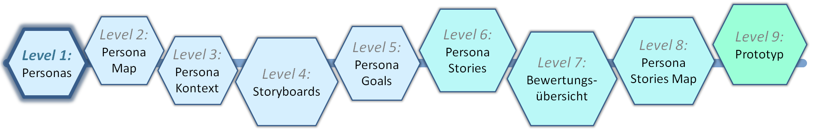
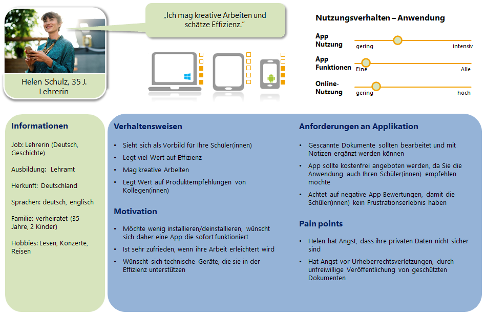
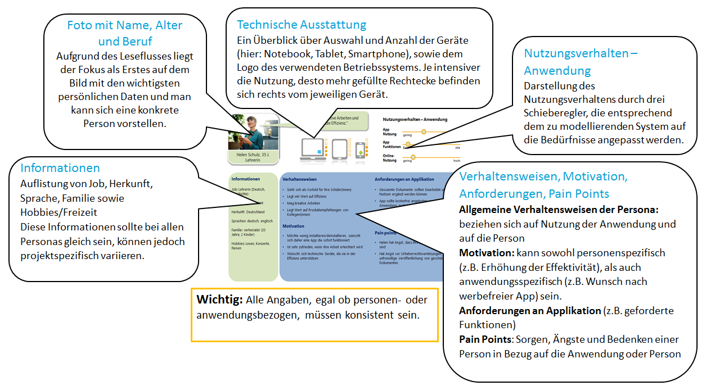

# Level 1: Personas

Im ersten Schritt wird die Zielgruppe bestimmt und anschließend das Ergebnis in Form von Steckbriefen als Personas dargestellt. Dies funktioniert nur in Teamarbeit. Die einzelnen Personas skizzieren konkrete Benutzer und werden im gesamten Gestaltungsprozess verwendet.

## Persona-Template

<figure markdown>
  
  <figcaption>Abbildung 1: Das Persona-Template.</figcaption>
</figure>

Das Template aus Abbildung 1 wurde in einem mehrstufigen Prozess konstruiert und evaluiert. Hierzu wurden verschiedene Persona-Templates unter dem Gesichtspunkt der einfachen Übersichtlichkeit und Erinnerbarkeit untersucht. In der nachfolgenden Abbildung 2 sind die elementaren Grundlagen des Templates genannt.

## Erläuterung des Templates

<figure markdown>
  
  <figcaption>Abbildung 2: Erläuterung des Persona-Templates.</figcaption>
</figure>

In diesem Anwendungsbeispiel werden ausschließlich sogenannte primäre Personas verwendet, die die wichtigsten Zielgruppen darstellen. Für kleinere, fachspezifische Anwendungen sind 3–5 verschiedene primäre Personas sinnvoll.

**Wichtig bei der Erstellung von Personas:**

- Nur authentisch wirkende, in sich stimmige Personas prägen sich positiv ein.
- Die Erstellung von Personas im Team sorgt für Akzeptanz und lässt unterschiedliche Sichtweisen einfließen.

Gute, passende Personas sind für das gesamte Projekt extrem wichtig, da sie die Grundlage für viele weitere Schritte und Entscheidungen bilden. Schlechte Personas führen im ungünstigsten Fall dazu, dass das Projekt am Anwender vorbei entwickelt wird oder sogar scheitert. Die Arbeit im Team senkt das Risiko, wichtige Personengruppen zu übersehen. Tiefergehende Informationen zu Personas finden sich in dem Artikel „Personas als Werkzeug in modernen Softwareprojekten“ von Holt et al. (2011).

Jedes Teammitglied erstellt eigenständig Personas und bringt sich ein. Im Anschluss daran werden alle Entwürfe gemeinsam angeschaut und bewertet und dann im letzten Schritt ausgewählte Personas weiter verfeinert.

Am Ende sollten die Personas gemeinsam vorgestellt werden, indem die Teammitglieder entweder jeweils in die Rolle einer bestimmten Persona schlüpfen oder diese aus der „Außen-Perspektive“ (Nachbar, Freunde) vorstellen.
