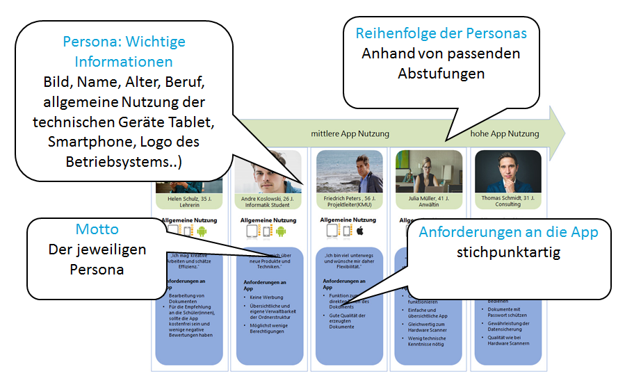

# Level 2 - Persona Map

Im nächsten Schritt wird mit der Persona Map eine Übersicht der Zielgruppe erstellt. Hier werden die vorher entwickelten Personas dargestellt.

Die Persona Map kann auch von einer einzelnen Person, ohne Teamarbeit, erstellt werden. Meist übernimmt dies der/die Hauptverantwortliche des Teams. Die Personas werden in eine sinnvolle Reihenfolge gebracht, die je nach Projekt unterschiedlich sein kann. Zusätzlich ist es wichtig zu überprüfen, ob Unstimmigkeiten auftreten. Es wäre fatal, wenn die Personas ausschließlich aus Männern bestehen, die Anwendung aber auch von Frauen genutzt wird.

In diesem Fall bietet sich eine Einteilung nach App-Nutzung von gering bis hoch an.

## Persona Map Template

<figure markdown>
  
  <figcaption>Abbildung 1: Das Persona Map Template.</figcaption>
</figure>

Alle grundlegenden Informationen aus den Personas werden auf der Map angeordnet. Dies sind neben den persönlichen Daten auch die Anforderungen an die App.

## Erläuterung des Templates

<figure markdown>
  
  <figcaption>Abbildung 2: Erläuterung des Persona Map Templates.</figcaption>
</figure>

Oft ist die Persona Map nur ein temporäres Artefakt und wird später in der Konzeption durch die „Persona Goals Map“ abgelöst.
