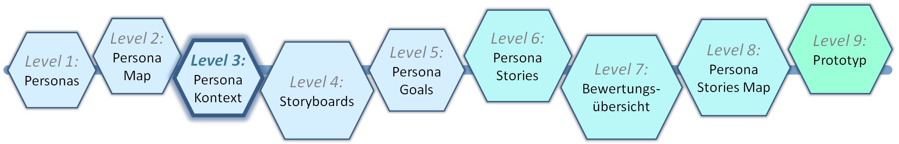
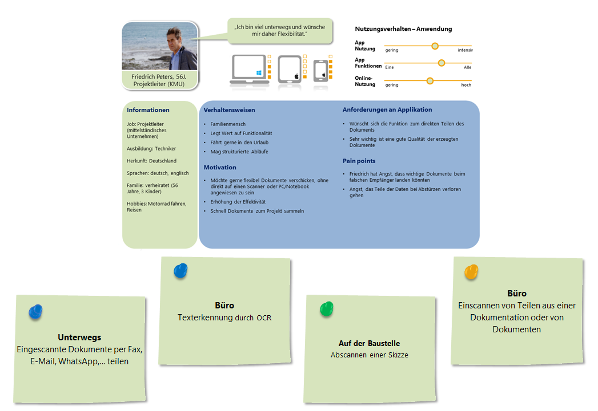
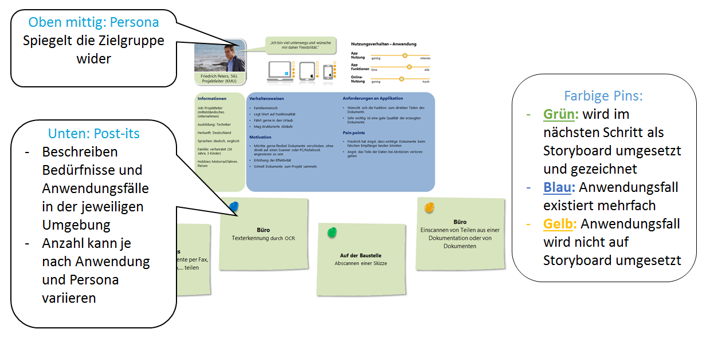

# Level 3 - Persona Kontext

Im dritten Schritt werden die zuvor erstellten Personas im Team in ihren jeweiligen Nutzungskontext eingeordnet und relevante Anwendungsfälle identifiziert. Idealerweise beginnt dieser Prozess mit der Verwendung eines Flipcharts, auf dem mit Klebezetteln gearbeitet wird. Anschließend wird das Ergebnis dokumentiert, sei es durch Fotografieren oder, wie hier, durch ein spezifisches Template. Die zentrale Leitfrage lautet:

**Was will die Person mit der Anwendung erreichen?**

Die Persona wird dabei oben mittig positioniert, während darunter, daneben oder darüber verschiedene Klebezettel mit Anwendungsfällen platziert werden. Unterschiedlich farbige Pins helfen dabei, festzulegen, welche Anwendungsfälle später als Storyboard ausgearbeitet werden sollen. Das entsprechende Template sieht wie folgt aus:

<figure markdown>
  
  <figcaption>Abbildung 1: Das Persona Kontext Template.</figcaption>
</figure>

Existiert ein Anwendungsfall bereits im Kontext einer anderen Persona, wird dies durch blaue Pins (oder Klebepunkte auf dem Flipchart) gekennzeichnet. Gelbe Pins markieren Anwendungsfälle, die entweder trivial sind oder erst in einer späteren App-Version realisiert werden sollen. Grüne Pins hingegen kennzeichnen wichtige Anwendungsfälle, die im nächsten Level in Storyboards überführt werden. Eine detaillierte Erläuterung des Templates findet sich hier:

<figure markdown>
  
  <figcaption>Abbildung 2: Erläuterung des Persona Kontext Templates.</figcaption>
</figure>

Der Persona Kontext unterstützt somit dabei, alle relevanten Anwendungsfälle für die Storyboards schnell zu identifizieren und die kritischen sowie diskussionswürdigen herauszufiltern.
