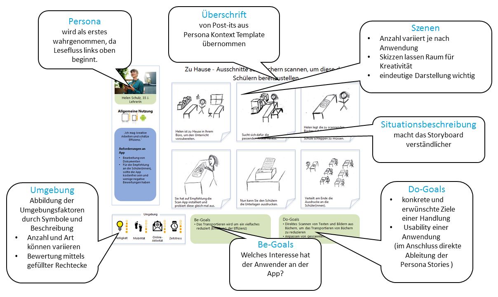

# Level 4 - Storyboards

Auf Storyboards wird der gesamte Nutzungskontext bildlich dargestellt. Wer nutzt was und welche Gründe hat er/sie dafür? Und wo hält er/sie sich dabei auf?

Storyboards werden im Team entwickelt. Die Skizzen, Grafiken oder kompakten Bildergeschichten sind vielseitig verwendbar und werden nicht nur im HCD, sondern auch in vielen anderen Bereichen wie z.B. bei der Visualisierung von Drehbüchern eingesetzt. Sie vermindern Sprachbarrieren und technische Einzelheiten können durch die Visualisierung besser kommuniziert werden. Gerade in internationalen Teams ist so die Zusammenarbeit leichter und es kommt zu weniger Missverständnissen (Holt et al. (2012)).

Mit Storyboards lassen sich komplexe Sachverhalte und spezielle Einsatz-Umgebungen anschaulich darstellen und anschließend diskutieren. Sie dienen als Gesprächsgrundlage im Team und damit ist der Detailgrad oder die zeichnerische Qualität nicht entscheidend. So sieht das entwickelte Template aus:

<figure markdown>
  
  <figcaption>Abbildung 1: Das Storyboard Template.</figcaption>
</figure>

Unser Template hat den sehr großen Vorteil, dass die Be-Goals (Motivationen) und die Do-Goals (Handlungsziele) getrennt betrachtet werden. Gerade das Überlegen der Be-Goals ist für eine gute User Experience sehr wichtig.

<figure markdown>
  
  <figcaption>Abbildung 2: Erläuterung des Storyboard Templates.</figcaption>
</figure>

Storyboards sollen helfen, das Anwendungsziel genau zu fokussieren. Hier kann erkannt werden, ob die Ziele der Personas wirklich praxisrelevant sind oder ob die Anwendungsfälle aus dem letzten Level „Persona Kontext“ nochmals überdacht und überarbeitet werden müssen.
