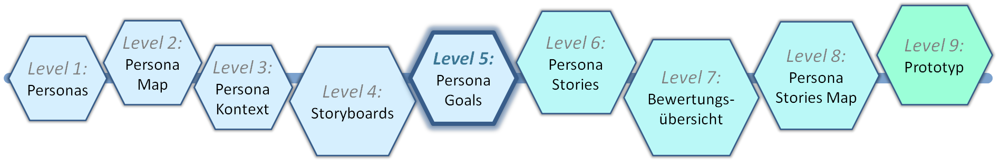
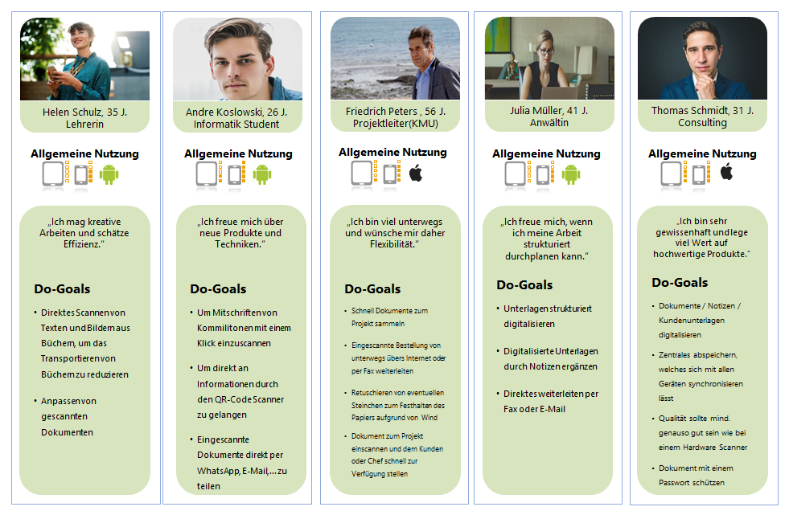

# Level 5 - Persona Goals Map

In diesem Schritt wird eine Übersicht der Do-Goals erstellt. Hierfür dient die Persona Goals Map als Ausgangsbasis für die spätere Priorisierung der Anforderungen und Mitbewerberanalyse. Ähnlich wie die Persona Map in Level 2 kann diese von einer einzelnen Person erstellt werden.

## Persona Goals Map Template

<figure markdown>
  
  <figcaption>Abbildung 1: Das Persona Goals Map Template.</figcaption>
</figure>

Im oberen Teil sind die Personas mit allen notwendigen Daten (Bild, Name, Alter, Beruf, allgemeine Nutzung der technischen Geräte und Motto) dargestellt, wie bereits in vorherigen Templates.

Im unteren Bereich werden unter jeder Persona die Do-Goals aus den Storyboards von Level 4 aufgeführt. Gut formulierte Storyboards ermöglichen es, im nächsten Schritt daraus problemlos die Persona Stories abzuleiten.
