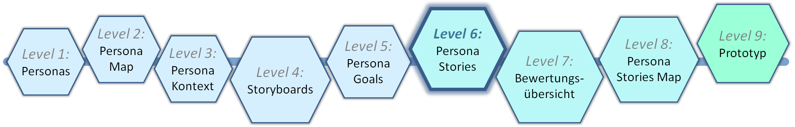
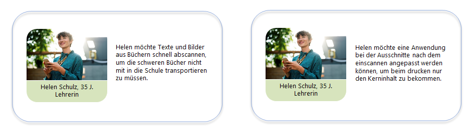

# Level 6 - Persona Stories

Jetzt ist der Zeitpunkt gekommen, die Do-Goals aus der eben erstellten Persona Goals Map zu Persona Stories umzuschreiben. Diese bestehen aus der Persona und einer User Story (siehe Holt et al. (2012)). Auch hierfür existiert ein Template.

## Persona Stories Template

<figure markdown>
  
  <figcaption>Abbildung 1: Das Persona Stories Template.</figcaption>
</figure>

Der Bezug zur Persona mit Foto und den Kerndaten Name, Alter und Beruf bleibt und ist im linken Teil untergebracht. Auf der rechten Seite stehen jetzt die Do-Goals als ausformulierter Satz.

Die dazugehörige Satzformel sieht so aus:

    <huge>
    ***"Persona" möchte [als "Rolle"] "Ziel/Wunsch", um "Nutzen"***
    </huge>

Dies ist ein bewährtes Verfahren, zu dem es diverse Quellen gibt, z.B. Sedeño et al. (2017), Hudson (2013). Wir haben das Verfahren schon im Jahr 2011 entwickelt und in Holt et al. (2012) sowie Winter et al. (2012) publiziert.

Die Persona Stories müssen übersichtlich und einfach zu erfassen sein, daher soll hier neben der Beschriftung des Bildes auch wirklich nur ein einziger Satz stehen. Zusätzlich werden sie durchnummeriert, damit man sie auf der Bewertungsübersicht (Level 7) zuordnen kann.

Die Anzahl der Stories kann je nach Anwendungsbeispiel unterschiedlich sein; eine Folie enthält aber immer alle Stories einer Persona. Im Beispielprojekt „Cam Scanner“ bewegte sich die Anzahl zwischen zwei und vier Stories.
