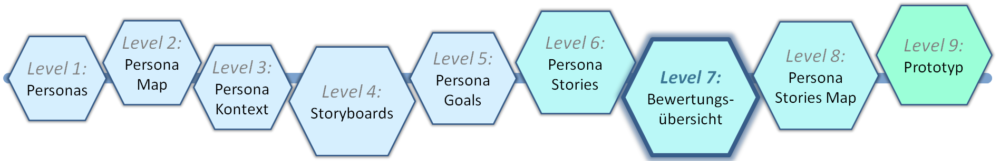
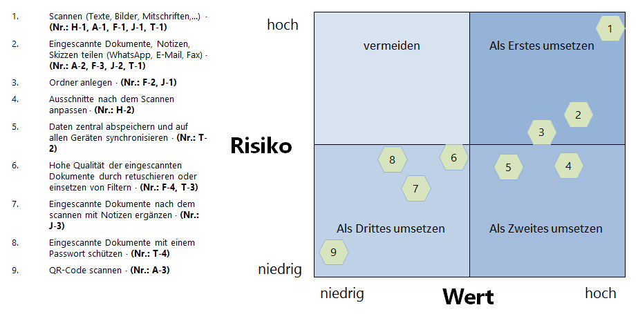
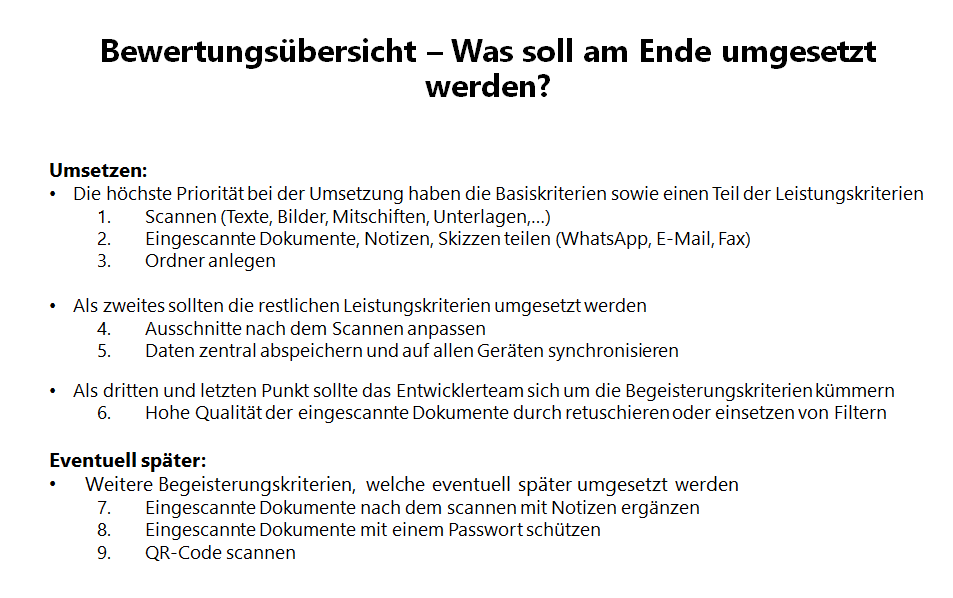

# Level 7 - Templatebasierter Prozess zu Human-Centred Design

In diesem Schritt werden die zuvor erstellten Persona Stories aus Level 6 priorisiert. Hierfür werden zwei Modelle verwendet: das **Kano-Modell** und das **Risiko-Wert-Modell**. Diese Ansätze ermöglichen eine Bewertung sowohl aus Anwender- als auch aus Unternehmenssicht.

## Bewertung der Persona Stories nach dem Kano-Modell: Was wollen die Anwender?

Das Kano-Modell kategorisiert Anforderungen in Basis-, Leistungs- und Begeisterungsmerkmale. Die folgende Tabelle zeigt die Zuordnung der Persona Stories zu diesen Kategorien:

| Persona   | Basismerkmale                                                                 | Leistungsmerkmale                                                                                     | Begeisterungsmerkmale                                                                 |
|-----------|-------------------------------------------------------------------------------|-------------------------------------------------------------------------------------------------------|----------------------------------------------------------------------------------------|
| **Helen** | Abscannen von Texten und Bildern aus Büchern (Nr.: H-1)                       |                                                                                                       | Ausschnitte nach dem Einscannen anpassen (Nr.: H-2)                                    |
| **André** | Mitschriften mit einem Klick einscannen (Nr.: A-1)                            | Eingescannte Dokumente direkt per WhatsApp oder E-Mail teilen (Nr.: A-2)                              | QR-Codes scannen (Nr.: A-3)                                                            |
| **Friedrich** | Dokumente von unterwegs einscannen (Nr.: F-1)                                 | Dokumente zu den Projekten einscannen und in Ordnern sortieren (Nr.: F-2)                             | Eingescannte Notizen/Skizzen schnell per WhatsApp, E-Mail oder Fax weiterleiten (Nr.: F-3) |
| **Julia** | Unterlagen einscannen und digital in Ordnern strukturieren (Nr.: J-1)         | Eingescannte Dokumente per Fax oder E-Mail verschicken (Nr.: J-2)                                     | Eingescannte Unterlagen nach dem Einscannen mit Notizen ergänzen (Nr.: J-3)            |
| **Thomas** | Kundenunterlagen von unterwegs einscannen (Nr.: T-1)                          | Daten zentral abspeichern und auf allen Geräten synchronisieren (Nr.: T-2)                            | Sehr hohe Qualität beim Scannen (Nr.: T-3)                                             |

Diese Kategorisierung hilft, die Anforderungen der Nutzer besser zu verstehen und entsprechend zu priorisieren.

## Bewertung anhand des Risiko-Wert-Modells: Was will das Unternehmen?

Das Risiko-Wert-Modell bewertet Anforderungen basierend auf ihrem Nutzen für das Unternehmen und dem damit verbundenen Risiko. Die  Abbildung 1 veranschaulicht dieses Modell.

<figure markdown>
  
  <figcaption>Abbildung 1: Das Risiko-Wert-Modell.</figcaption>
</figure>

Auf der linken Seite stehen die Anforderungen, dabei werden identische jeweils zu einem Punkt zusammengefasst und die Nummerierung aus den Persona Stories zur besseren Zuordnung verwendet.

Auf der rechten Seite werden die einzelnen Kernaussagen in einem Koordinatensystem nach bestimmten Kriterien angeordnet. Die Ausgestaltung des Risiko-/Wert-Modells kann je nach Anwendungsfall unterschiedlich aussehen.

Die Anforderungen werden in vier Kategorien eingeteilt:

1. **Risiko hoch / Wert hoch**: Diese Anforderungen sollten als Erstes umgesetzt werden.
2. **Risiko niedrig / Wert hoch**: Diese Anforderungen sollten als Zweites umgesetzt werden.
3. **Risiko niedrig / Wert niedrig**: Diese Anforderungen können später umgesetzt werden.
4. **Risiko hoch / Wert niedrig**: Diese Anforderungen sollten vermieden werden.

**Wichtig**: Die Stichpunkte auf der linken Seite müssen die gleiche Reihenfolge haben, wie die Punkte im Koordinatensystem.

Durch diese Einteilung kann das Unternehmen entscheiden, welche Anforderungen priorisiert werden sollten, um den größten Nutzen bei geringstem Risiko zu erzielen.

## Zusammenführung der Bewertungen

Die Ergebnisse aus dem Kano-Modell und dem Risiko-Wert-Modell werden in einer Bewertungsübersicht zusammengeführt. Diese Übersicht ermöglicht es, sowohl die Anwender- als auch die Unternehmensperspektive bei der Priorisierung der Anforderungen zu berücksichtigen. Die folgende Abbildung zeigt eine beispielhafte Bewertungsübersicht:

<figure markdown>
  
  <figcaption>Abbildung 2: Beispielhafte Bewertungsübersicht.</figcaption>
</figure>

### Welchen Nutzen hat die Bewertungsübersicht?

Die Bewertungsübersicht führt die Bewertung aus Anwender- und Unternehmenssicht zusammen und sorgt dafür, dass am Ende beide Sichtweisen bei der Erstellung eines Prototyps berücksichtigt werden. Die Bewertungsübersicht erleichtert das Herausfiltern der wichtigsten Persona Stories und damit auch die Entscheidung, welche Funktionen am Ende umgesetzt werden. Damit entlastet sie auch die Entwickler, die sich so auf das Wesentliche fokussieren kann. Die Begeisterungskriterien haben in diesem Beispiel eine niedrige Priorität, da sie in diesem Beispiel eher speziell sind und nicht so viele Anwender erreichen. Sie können jedoch für größere Zufriedenheit sorgen und haben auch ein relativ niedriges Risiko für das Unternehmen.
