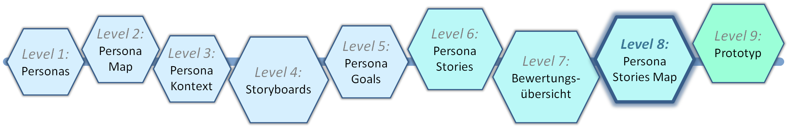
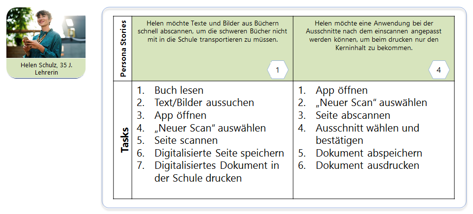
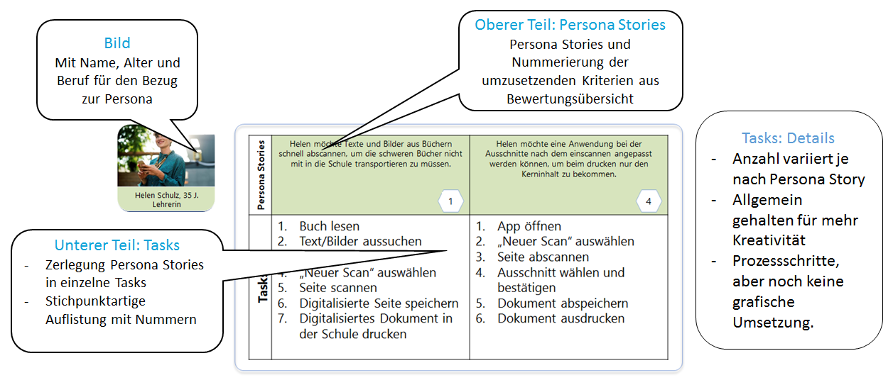

# Level 8 - Persona Stories

In diesem Schritt werden die in Level 6 erstellten Persona Stories mithilfe der Bewertungsübersicht aus Level 7 auf die für die Umsetzung relevanten Stories reduziert und in einzelne Tasks aufgeteilt.

## Persona Stories Map Template

<figure markdown>
  
  <figcaption>Abbildung 1: Das Persona Stories Map Template.</figcaption>
</figure>

Das Bild der Persona mit den wichtigsten Rahmendaten bleibt erhalten, um eine eindeutige Zuordnung zur entsprechenden Persona zu gewährleisten. Zusätzlich enthält das Template eine Tabelle, die in zwei Bereiche unterteilt ist:

- **Persona Stories**: Enthält die Nummerierung der umzusetzenden Kriterien aus Level 7.
- **Tasks**: Listet die stichpunktartig formulierten Aufgaben auf.

## Erläuterung des Templates

<figure markdown>
  
  <figcaption>Abbildung 2: Erläuterung des Persona Stories Map Templates.</figcaption>
</figure>

Es ist wichtig, dass die Tasks allgemein genug gehalten werden, um die Kreativität der Entwickler*innen nicht zu behindern oder deren Spielraum einzuschränken. Eine grafische Umsetzung spielt zu diesem Zeitpunkt noch keine Rolle bei den Tasks.
