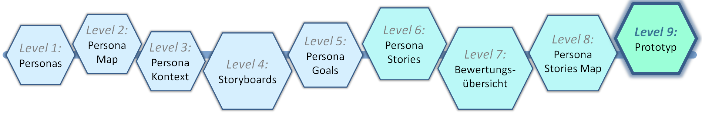
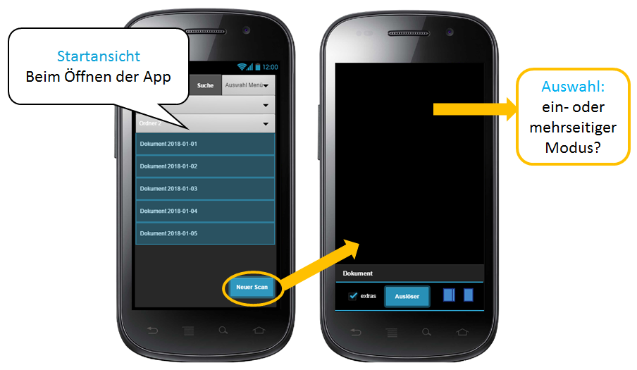
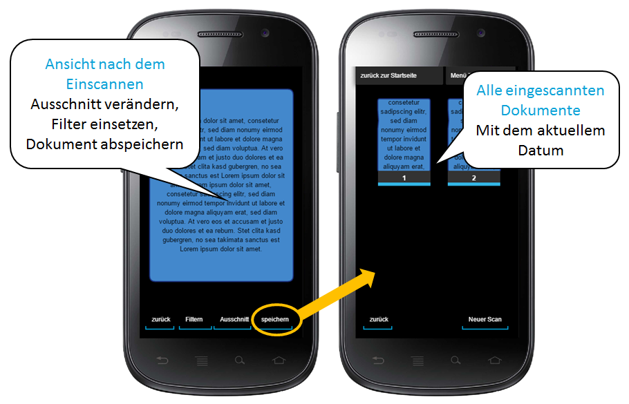

# Level 9 - Prototyp

Mithilfe von Prototypen kann ein Großteil eines interaktiven Systems dargestellt und anschließend analysiert werden. Durch das Feedback und die daraus gewonnenen Erkenntnisse können Konzepte bei Bedarf verbessert werden, wodurch das Risiko einer Fehlentwicklung sinkt.

Auf der Zielgeraden angekommen, wird die Anwendung nun konkret, den Nutzerbedürfnissen entsprechend, gestaltet und ein Prototyp erstellt. Hier werden die Kriterien aus der Persona Stories Map umgesetzt.

Im Anwendungsbeispiel wird ein einfacher computerbasierter Prototyp verwendet. Beginnend mit dem Startbildschirm werden dabei verschiedene Ansichten der App und ihrer Navigation dargestellt.

## Start der App

<figure markdown>
  
  <figcaption>Abbildung 1: Start der App.</figcaption>
</figure>

Links in Abbildung 1 ist die Startansicht der App zu sehen, rechts die Ansicht, die sich nach dem Anwählen von „Neuer Scan“ öffnet.

## Schritte nach dem Scannen

<figure markdown>
  
  <figcaption>Abbildung 2: Schritte nach dem Scannen.</figcaption>
</figure>

Anschließend wird in Abbildung 2 links die Ansicht nach dem Einscannen dargestellt. Hier kann zum Beispiel noch der Ausschnitt verändert oder das Dokument abgespeichert werden. Rechts zeigt die Ansicht nach dem erfolgreichen Abspeichern des Dokuments.

## Low-Fidelity und High-Fidelity

Allgemein werden Prototypen nach dem Grad der Genauigkeit unterschieden.

**Low-Fidelity-Prototypen** sind schnell und kostengünstig zu erstellen und benötigen keine besonderen Vorkenntnisse. Sie sind gut geeignet, um Ideen zu vermitteln und weiterzuentwickeln. Durch die niedrige Einstiegshürde können alle Beteiligten unkompliziert eingebunden werden. Die grafische Gestaltung ist dabei nachrangig; es geht vor allem um die ersten Schritte bei der Entwicklung und das Erarbeiten einer Struktur. Beispiele: Mindmaps, Klebezettel und Papierskizzen.

**High-Fidelity-Prototypen** sind interaktive Prototypen und grafisch relativ detailliert. Sie werden oft mit Prototyping-Software erstellt. Der Look & Feel kommt der zukünftigen Anwendung schon sehr nahe.

Beginnen Sie immer mit einem handgezeichneten Low-Fidelity-Prototypen, denn nur so ist gewährleistet, dass Prototypen auch einfach verändert oder gar verworfen werden können. Je mehr Aufwand in einen Prototypen gesteckt wurde, desto stärker wird der Prototyp gegen Änderungen verteidigt werden. Das Ziel des Prototypen ist jedoch die gemeinsame Diskussion und die einfache Verbesserung und nicht die Darstellung der finalen Version.

Durch die anschließende, detaillierte Ausarbeitung (High-Fidelity-Prototypen) können notwendige Detailverbesserungen erkannt und anschließend erste Tests mit realen Nutzern durchgeführt werden.
