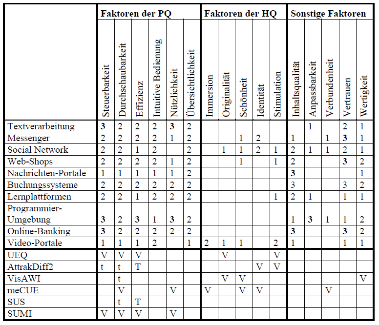

# UX Faktoren und Fragebögen

???+ example "Grundlage dieses Beitrags sind folgende Publikationen"

    1. Rauschenberger, M.; Schrepp, M.; Pérez-Cota, M.; Olschner, S. & Thomaschewski, J. (2013): **[Efficient Measurement of the User Experience of Interactive Products. How to use the User Experience Questionnaire (UEQ). Example: Spanish Language Version](https://doi.org/10.9781/ijimai.2013.215)**. In: *International Journal of Interactive Multimedia and Artificial Intelligence*, Bd. 2, Nr. 1, S. 39–45. DOI: 10.9781/ijimai.2013.215.

    2. Winter, D.; Hinderks, A.; Schrepp, M. & Thomaschewski, J. (2017): **[Welche UX Faktoren sind für mein Produkt wichtig?](https://dl.gi.de/handle/20.500.12116/5770)**. In: Steffen Hess und Holger Fischer (Hrsg.): *Mensch & Computer – Usability Professionals*. Bonn, S. 191–200.

    3. Thomaschewski, J.; Hinderks, A. & Schrepp, M. (2018): **[Welcher UX-Fragebogen passt zu meinem Produkt?](https://dl.gi.de/bitstream/handle/20.500.12116/16786/Beitrag_150_final__a.pdf?sequence=1)**. In: Steffen Hess und Holger Fischer (Hrsg.): *Mensch & Computer – Usability Professionals*. Bonn, S. 437–445.

    4. Schrepp, M. & Thomaschewski, J. (2019a): **[Eine modulare Erweiterung des User Experience Questionnaire](https://dl.gi.de/bitstream/handle/20.500.12116/24466/muc2019-up-0108.pdf?sequence=1)**. In: Steffen Hess und Holger Fischer (Hrsg.): *Mensch & Computer – Usability Professionals*. Bonn, S. 148–156.

    5. Schrepp, M. & Thomaschewski, J. (2019b): **[Design and Validation of a Framework for the Creation of User Experience Questionnaires](https://doi.org/10.9781/ijimai.2019.06.006)**. In: *International Journal of Interactive Multimedia and Artificial Intelligence (IJIMAI)*, Vol. 5, No. 7, S. 88–95. DOI: 10.9781/ijimai.2019.06.006.

**Standardfragebögen** gelten als gutes Werkzeug zur Messung der User Experience (Rauschenberger et al., 2013). Dabei ist der Anspruch der Standardfragebögen, dass damit die Usability oder User Experience (UX) unterschiedlichster Produkte gleich gut gemessen werden kann. 

Langjährige Erfahrungen in der Messung und Auswertung zeigen aber, dass ein Fragebogen nicht für alle Produkte bzw. Produktgruppen optimal geeignet ist. Zu sehr unterscheiden sich die Produkte. Beispielsweise sind bei Textverarbeitungssoftware Faktoren wie „Originalität“ und „Stimulation“ nicht so bedeutend wie bei Social-Media-Anwendungen. Auf Basis dieser Idee wurde in einem aufwändigen, mehrjährigen Verfahren der modulare Fragebogen „User Experience Questionnaire Plus“ (UEQ+) entwickelt und im Jahr 2019 veröffentlicht.

Um zu ermitteln, welche **UX-Faktoren aus Nutzersicht** bei welchem Produkt wichtig sind, wurden zwei Studien (Winter et al., 2017; Thomaschewski et al., 2018) durchgeführt, bei denen Nutzer die Wichtigkeit verschiedener UX-Faktoren für verschiedene Produktkategorien einschätzen. Auch wurde in diesen Studien auf die bis dato existierenden Usability- und UX-Fragebögen eingegangen.

In Thomaschewski et al. (2018) wurde die Studie von Winter et al. (2017) mit den 16 UX-Faktoren und 10 Produktkategorien wiederholt und kam (selbst zur Überraschung der Autoren) genau zu denselben Ergebnissen. Außerdem wurde angegeben, welche Usability- und UX-Fragebögen welche UX-Faktoren vollständig (V) oder teilweise (t) messen.

**Eingeschätzte Wichtigkeit von UX-Faktoren bezüglich unterschiedlicher Produktkategorien**

<figure markdown>
  
  <figcaption>Abbildung 1: Eingeschätzte Wichtigkeit von UX-Faktoren bezüglich unterschiedlicher Produktkategorien (Thomaschewski et al., 2018).</figcaption>
</figure>

Diese Tabelle kann eine erste Orientierung geben, welche Faktoren für ein Produkt wichtig sein könnten.

Die Zahlen in der Tabelle sind wie folgt zu lesen:

- 3 = sehr wichtig
- 2 = wichtig
- 1 = nicht ganz so wichtig

Hedonische UX-Faktoren wurden als weniger wichtig eingeschätzt (siehe Tabelle). Dies überrascht nicht, da Menschen dazu neigen, eine Produktauswahl pragmatisch zu begründen. Denken Sie einmal an Ihren letzten Kauf eines Autos oder Fernsehers. Zunächst werden pragmatische Kriterien festgelegt, doch die Entscheidung für ein Produkt fällt oft aufgrund hedonischer Eigenschaften (und des Preises). Somit sollte jedes Unternehmen auch festlegen, welche hedonischen Eigenschaften ihre Produkte erreichen sollten, damit die Kaufentscheidung zugunsten der eigenen Produkte stattfindet.

In Schrepp und Thomaschewski (2019a, 2019b) wird die Konstruktion des UEQ+ beschrieben, der mit all seinen Materialien ebenso wie der UEQ kostenlos erhältlich ist.

- Zum UEQ: [www.ueq-online.org](https://www.ueq-online.org)
- Zum UEQ+: [ueqplus.ueq-research.org](https://ueqplus.ueq-research.org)

## Welche UX-Faktoren gibt es im UEQ+?

Der **User Experience Questionnaire Plus (UEQ+)** bietet eine modulare Erweiterung des klassischen UEQ und umfasst eine Vielzahl von Faktoren, die je nach Produkt und Anwendungsszenario ausgewählt werden können. Die verfügbaren Faktoren sind:

- **Attraktivität**: Gesamteindruck des Produkts im Sinne einer gut/schlecht Bewertung.
- **Effizienz**: Können Nutzer ihre Aufgaben schnell und ohne unnötigen Aufwand erledigen?
- **Durchschaubarkeit**: Wird es als einfach empfunden, die Bedienung des Produkts zu erlernen?
- **Steuerbarkeit**: Hat der Nutzer das Gefühl, stets die volle Kontrolle über die Interaktion zu besitzen?
- **Stimulation**: Wird die Arbeit mit dem Produkt als spannend und interessant empfunden?
- **Originalität**: Wird das Design des Produkts als innovativ und kreativ empfunden?
- **Vertrauen**: Hat der Nutzer das Gefühl, dass seine Daten in sicheren Händen sind?
- **Anpassbarkeit**: Kann das Produkt an persönliche Vorlieben angepasst werden?
- **Nützlichkeit**: Bietet die Nutzung des Produkts Vorteile?
- **Wertigkeit**: Macht die Gestaltung des Produkts einen hochwertigen und professionellen Eindruck?
- **Visuelle Ästhetik**: Wird die visuelle Gestaltung des Produkts als ansprechend und schön empfunden?
- **Intuitive Bedienung**: Kann das Produkt ohne Anleitung oder Hilfe direkt bedient werden?
- **Inhalts-Seriosität**: Wird die durch das Produkt bereitgestellte Information als verlässlich und vertrauenswürdig empfunden?
- **Inhalts-Qualität**: Wird die vom Produkt bereitgestellte Information als interessant und gut aufbereitet empfunden?
- **Übersichtlichkeit**: Macht das User Interface des Produkts einen strukturierten und geordneten Eindruck?

**Spezifisch für Voice User Interfaces**

- **Antwortverhalten**: Sind die Antworten des Sprachassistenten höflich, respektvoll und vertrauenswürdig?
- **Antwortqualität**: Erfüllen die Antworten eines Sprachassistenten den Informationsbedarf des Benutzers?
- **Verständnis**: Versteht der Sprachassistent die Anweisungen und Fragen der Benutzer in natürlicher Sprache richtig?

**Spezifisch für Geräte**

- **Haptik**: Wird die Berührung des Produkts als angenehm empfunden?
- **Akustik**: Werden die Betriebsgeräusche des Produkts als angenehm empfunden?

**Für komplexe medizinische Geräte**

- **Ergebnisqualität**: Können Ziele und Ergebnisse vollständig und genau durch die Nutzung des Produkts erreicht werden?
- **Hardware-Sicherheit**: Birgt die Hardware Risiken, die gesundheitsschädlich sein könnten?
- **Risikohandhabung**: Können Nutzer Risiken und Fehler identifizieren und handhaben?

**Soziale Faktoren**

- **Identifikation**: Eindruck, dass die Nutzung oder der Besitz eines Produkts den sozialen Status beeinflusst.
- **Soziale Interaktion**: Eindruck des Nutzers, dass das Produkt soziale Aktivitäten unterstützt oder hilft, soziale Kontakte aufzubauen.
- **Soziale Stimulation**: Eindruck des Nutzers hinsichtlich der erwarteten sozialen Gewinne durch die Interaktion mit einem Produkt.
- **Soziale Akzeptanz**: Eindruck des Nutzers, wie sie selbst und andere die Nutzung eines Produkts akzeptieren und gutheißen.

Diese Faktoren ermöglichen eine flexible Anpassung des Fragebogens an spezifische Evaluationsszenarien. Weitere Informationen finden Sie im [UEQ+ Handbuch](https://ueqplus.ueq-research.org/Material/UEQ%2B_Handbook_V3.pdf). 

## UX-Faktoren für Ihr Produkt festlegen

Bei der Evaluation der User Experience mit dem UEQ+ müssen zunächst die zu messenden UX-Faktoren festgelegt werden. Der finale Fragebogen sollte dabei maximal sieben UX-Faktoren abfragen, da ansonsten der Fragebogen zu lang wird.

Es gibt zwei Ansätze zur Festlegung der relevanten UX-Faktoren:

1. **Management-Entscheidung**: Das Management bestimmt, welche UX-Faktoren gemessen werden sollen.
2. **Nutzerbefragung**: Nutzer werden dazu befragt, welche UX-Faktoren wichtig sind und gemessen werden sollten.

Empfohlen wird eine Kombination beider Vorgehensweisen. Einerseits sollten die Nutzer befragt werden, andererseits sollte das Management überlegen, welche (auch hedonischen) Faktoren gegenüber den Mitbewerbern entscheidend sind und das Produkt auszeichnen.

## Fragebogen

In der Praxis hat sich gezeigt, dass es im Management und im Entwicklungsteam kein einheitliches Verständnis für die **„besonders wichtigen UX-Faktoren“** gibt. Natürlich können diese vom oberen Management festgelegt werden, aber ein besseres Vorgehen ist die Schaffung eines einheitlichen Verständnisses zu den Faktoren im gesamten Entwicklungsteam. So wird empfohlen in einer Methode besstehend aus Fragebogen & Diskussion zunächst ein einheitliches Verständnis zu schaffen. 

???+ tip "Experten Jörg Thomaschewski, Andreas Hinderks, Dominique Winter"
    **Jörg Thomaschewski** (<small>Prof. Dr.</small>){align=right width="20%"}  arbeitet an der Hochschule Emden/Leer und ist Gründer der Forschungsgruppe "Research Group for Agile Software Development and User Experience". Als Mitentwickler der UEQ-Familie (UEQ-S, UEQ+) hat er praxisorientierte Werkzeuge geschaffen, die weltweit zur Analyse und Optimierung der UX eingesetzt werden. Neben seiner akademischen Tätigkeit berät und schult er Unternehmen in den Bereichen UX-Management und agile Methoden. Sein Ziel ist es, Forschung und Praxis zu verbinden, um Unternehmen bei der Entwicklung benutzerzentrierter digitaler Produkte zu unterstützen.

    ---

    **Andreas Hinderks** (<small>Prof. Dr.</small>){align=right width="20%"}  arbeitet an der Hochschule Hannover und ist langjähriger Experte im Bereich User Experience (UX). Sein Fokus liegt darauf, UX in Organisationen sichtbar und strategisch nutzbar zu machen. Durch gezielte Methoden aus dem UX-Management unterstützt er Teams dabei, digitale Produkte mit einem hervorragenden Nutzererlebnis zu gestalten. Mit seiner Promotion im Jahr 2021 auf dem Gebiet des UX-Managements und seiner kontinuierlichen Forschung bringt er wissenschaftliche Erkenntnisse in die Praxis ein – sowohl in Unternehmen als auch in der Lehre.

    ---

    **Dominique Winter** (<small>Doktorand, M.Sc., M.A. (Promotion an der Universität Siegen)</small>){align=right width="20%"} 
    ist Experte für die erlebnisorientierte Produktentwicklung und unterstützt Organisationen dabei, begeisternde digitale Produkte zu entwickeln. Er greift dabei auf Methoden aus dem agilen Coaching, dem UX-Management und der kompetenzorientierten Organisationsentwicklung zurück. Praktische Erfahrungen ergänzt er durch Forschung (u.A. Promotion zum Thema UX-Kompetenzen von Organisationen) und verbindet so Theorie und Praxis.  
